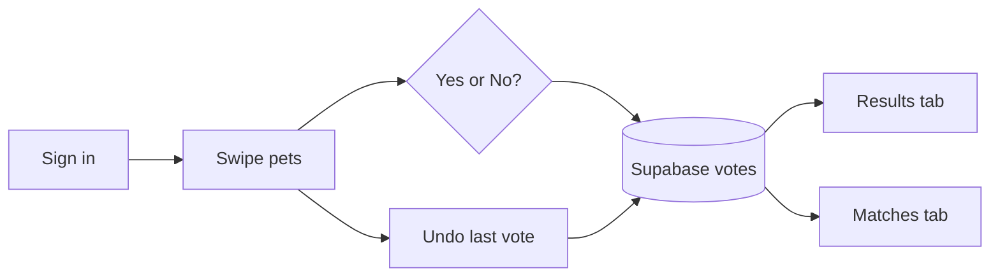

# PawSwipe

**Swipe-to-vote for adoptable pets** — a mobile app where you say yes or no to each pet, see how the community voted, and discover matches when you and the crowd agree.

Built for **CMPE 282** (Expo SDK 54 + Supabase). Demo with Expo Go, iOS Simulator, or `npm run web`.

> **Note:** The assignment brief describes a *mobile web* layout (390×844). This project uses **React Native / Expo** for a native swipe experience on phone or simulator.

---

## The concept

**Swipe-to-vote** is a simple pattern: one item at a time, a binary choice, and a shared backend that records everyone’s answers.

| Idea | How PawSwipe implements it |
|------|----------------------------|
| **One item per screen** | A card deck shows one adoptable pet at a time (photo, name, short description). |
| **Binary vote** | Swipe **right** (or tap Yes) = “I’d adopt” · Swipe **left** (or tap No) = “Pass.” |
| **Shared truth** | Every vote is stored in **Supabase Postgres**. Results and Matches are computed from **all users**, not just your phone. |
| **Progress** | The app tracks which pets you’ve already voted on and shows a clear **end-of-deck** state when you’re done. |
| **Identity (stretch)** | Sign in with email so your votes persist across sessions and feed into **Matches**. |

Think of it as **Tinder for adoption decisions**: fast, visual, and opinionated — but the “winner” is community sentiment in the **Results** tab, not a mutual chat.

---

## Theme: adoptable pets (PawSwipe)

The product is themed around **real adoptable pets**, not generic stock cards.

| Theme element | Details |
|---------------|---------|
| **Domain** | Dogs and cats (and mixed listings) looking for homes. |
| **Yes vote** | “I’d adopt this pet” — swipe right, green accent, paw-forward tone. |
| **No vote** | “Not for me” — swipe left, pass without guilt; you’re filtering, not rejecting the pet permanently. |
| **Content** | **110+ items** in the database, each with an **image URL**, **title** (pet name), and **description** (breed, age, personality blurb). |
| **Photos** | Seeded from real pet APIs where possible (`dog.ceo`, The Cat API); `npm run generate-items` refreshes image URLs before re-seeding. |
| **Branding** | App name **PawSwipe**, paw tab icons, warm palette — built to feel like a small adoption discovery app, not a generic poll UI. |

**Why this theme?** It makes the swipe mechanic intuitive (like/don’t-like), keeps cards visually rich (photos matter), and gives Results/Matches a story: *“Which pets does our class community love — and which ones did I love that they also loved?”*

---

## Core features

| Feature | What it does | Where |
|---------|----------------|-------|
| **Swipe deck** | Drag cards left/right with tilt, color tint, and threshold; Yes/No buttons as an alternative to gestures. | **Vote** tab (`app/(tabs)/index.tsx`, `SwipeDeck`) |
| **Vote persistence** | Each logged-in user gets **one vote per pet**; changing your mind updates the same row (dedup via unique `(item_id, user_id)`). | Supabase `votes` + `submitVote()` |
| **110+ catalog** | Items loaded from Postgres; empty DB shows setup/seed instructions instead of a fake “all done” screen. | `fetchItems()`, `scripts/seed.mjs` |
| **Results** | Community aggregates: yes/no counts and yes **percentage** per pet; sort by most loved, most divisive, or fewest votes. | **Results** tab |
| **End of deck** | When you’ve voted on every pet, home shows completion state (distinct from “database has zero items”). | Vote tab |
| **Email login** | Sign up / sign in with email + username; session stored on device (SecureStore). No Supabase Auth email links. | `app/login.tsx`, `users` table + RPCs |
| **Undo** | Revert your **last** swipe and remove that vote from the server. | Vote tab |
| **Matches** | Pets you voted **yes** on where **≥ 60%** of community votes are also yes — “you and the crowd agree.” | **Matches** tab |
| **Live-ish results** | Results poll every **5 seconds** so aggregates update while you demo. | Results tab |
| **Seed & demo data** | Scripts to load pets, fake community votes, and a demo account for grading videos. | `npm run seed`, `seed-demo-votes`, `seed-user` |
| **Analytics (basic)** | Session start and swipe timing events for rough usage metrics. | `analytics_events` table |

### Assignment mapping (API → Supabase)

| Spec | Implementation |
|------|----------------|
| `GET /items` | `fetchItems()` → `items` table |
| `POST /vote` | `submitVote()` → `votes` insert/update |
| `GET /results` | `fetchResults()` → `item_results` view |

---

## How it works (user flow)



1. **Sign in** (or create an account).
2. **Vote** tab — swipe through the deck; each choice is saved immediately.
3. **Results** — see global rankings and percentages (refreshes on a timer).
4. **Matches** — see pets you loved that the community also loved (after enough demo votes exist).

---

## Tech stack

| Layer | Choice |
|-------|--------|
| **Mobile** | React Native, **Expo SDK 54**, Expo Router (file-based tabs) |
| **Gestures / UI** | `react-native-gesture-handler`, Reanimated, custom `SwipeDeck` |
| **Backend** | **Supabase Postgres** — `items`, `votes`, `users`, `item_results` view, RLS |
| **Auth** | Custom `users` table + bcrypt (`pgcrypto`) RPCs — avoids Supabase Auth confirmation/rate limits |
| **Local session** | `expo-secure-store` via `AuthContext` |

---

## Quick start

### 1. Supabase

1. Create a project at [supabase.com](https://supabase.com).
2. Run migrations **in order** in the SQL Editor:
   - [`supabase/migrations/001_initial.sql`](supabase/migrations/001_initial.sql)
   - [`supabase/migrations/002_simple_login.sql`](supabase/migrations/002_simple_login.sql)
   - [`supabase/migrations/003_vote_upsert_constraint.sql`](supabase/migrations/003_vote_upsert_constraint.sql)
3. Enable **pgcrypto** under Database → Extensions if `gen_salt` errors appear when seeding users.

### 2. Environment

Create a `.env` in the project root (never commit this file):

```env
EXPO_PUBLIC_SUPABASE_URL=https://xxxx.supabase.co
EXPO_PUBLIC_SUPABASE_ANON_KEY=eyJ...
SUPABASE_SERVICE_ROLE_KEY=eyJ...   # seed scripts only — not used in the app bundle
```

### 3. Install & seed

```bash
npm install
npm run seed                  # 110 pets into items table
npm run seed-demo-votes       # ~3,600 fake community votes (Results/Matches)
npm run seed-user             # demo@pawswipe.app / password123
```

Optional — refresh pet photos from APIs:

```bash
npm run generate-items
npm run seed
```

### 4. Run

```bash
npx expo start --clear
```

Open **Expo Go** (QR), press `i` for iOS Simulator, or `w` for web.

**Demo login:** `demo@pawswipe.app` / `password123` (created by `npm run seed-user`). You can also sign up with any email + username.

---

## Project structure

```
app/
  login.tsx              # sign in & sign up
  (tabs)/
    index.tsx            # Vote — swipe deck, undo, sign out
    results.tsx          # community aggregates
    matches.tsx          # your yes + high community yes %
src/
  lib/api.ts             # items, votes, results, analytics
  lib/authApi.ts         # login_user / register_user RPCs
  contexts/AuthContext.tsx
  components/SwipeDeck.tsx, VoteCard.tsx
supabase/migrations/     # 001, 002, 003
scripts/                 # seed, seed-demo-votes, seed-user, generate-items
```

---

## Known limitations

- First image load depends on network.
- `npm run generate-items` needs internet (~30s).
- Web swipe feel may differ slightly from a physical device.
- RLS trusts `user_id` from the client — acceptable for a class demo; production would use stricter server-side auth.

---

## AI usage

See [`AI_NOTES.md`](AI_NOTES.md) for collaboration notes and verification checklist.
